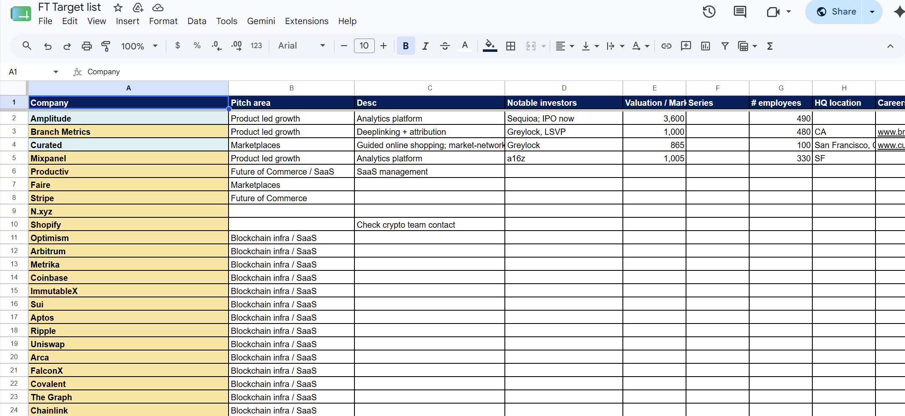
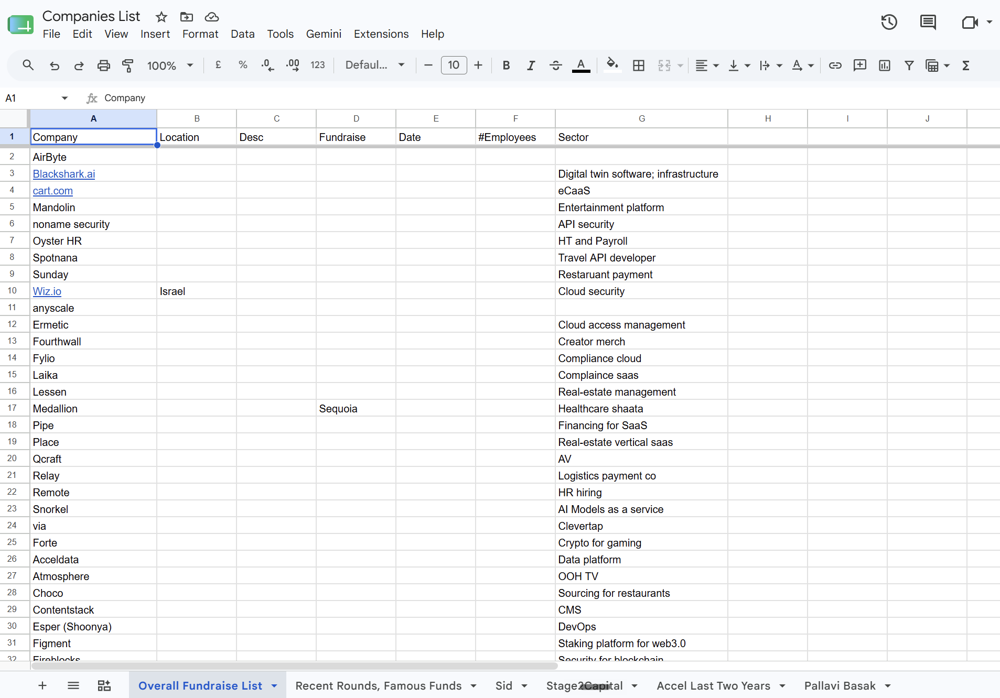

## The job "hunting" process is broken 

Over the last decade, I’ve changed roles five times. You’d think that navigating the tech ecosystem as a veteran job hunter would make the process smoother, but instead, it has only highlighted how painful it is as an applicant. Despite all the innovation we build _for_ our companies, the tools we use to manage our own careers are non-existent at best.

Through every job hunt, I’ve run into three core problems:

1. **Passive discovery is a chore:** It is incredibly painful and manual to discover and track roles in compelling, high-growth companies that I'd like to join

2. **Pipeline management is a black box:** Keeping track of active applications, interview stages, and the actual state of a listing is impossibly difficult.

3. **Collaboration is high-friction:** Teaming up with friends to share leads, pool networks, and swap referrals is a clunky, disjointed experience.

This probably sounds familiar, but let me drive home the point with a few anecdotes of how this plays out in reality.

#### The Endless "Dream List" Ledger

When I transitioned into tech, I wanted to be intentional. I started building a "dream list" of target companies. These weren’t just household names; they were promising startups funded by top-tier VCs, or emerging players I discovered buried in fundraising newsletters.

The goal was simple: track them, monitor their career pages for openings, and find internal connections for a warm referral.

The reality? I ended up spending hours copy-pasting company names, their careers URLs pages into a sprawling spreadsheet. Instead of spending my energy preparing for interviews or researching markets, I was acting as a manual data-entry clerk for my own career. I checked up on these pages ever so often to see if a role opened up, and if it did, copy pasted the role into the spreadsheet to apply for "when I had more time".

For the keen eyed, you'd ask me : Why didn't you just set up linkedin alerts - I tried, and it was extremely annoying to set up, maintain and manage lifecycle of these notifications.

 Example spreadsheet from my job hunt a few years ago 

#### The Spreadsheet Abyss

The real administrative nightmare began once I actually started applying, . My days became consumed by manual updates: moving a row from "Applied" to "First Round," trying to decipher automated emails, and trying to gauge if my strategy was actually working.

The worst part is the radio silence. There is nothing more frustrating than waiting weeks for an update, only to discover through manual checking that the job listing was quietly closed days ago. I was left wondering if my resume even hit a human desk before the door shut.

#### The Fractional Network

Job hunting shouldn't be a solo sport, there's always one friend who is looking out while you are, and if you're in college, there's definitely more. My friends and I tried to build a massive, shared spreadsheet where we tracked companies we liked across separate tabs, alongside a completely different sheet to track our individual progress without exposing the noisy, day-to-day details of our pipelines.

We did this for two reasons: collective awareness and referral pooling. If a friend had a contact at a company on my radar, that connection was gold. But maintaining this decentralized web of spreadsheets required constant maintenance. The friction was so high that the system eventually collapsed under its own weight.

 The last four tabs are us sharing amongst friends

### Process Is the Bottleneck

Here's the thing most people get wrong about job hunting: it's actually _easy_ to find open roles. Type a company name and "jobs" into Google and a bazillion links show up. Open LinkedIn, search your title — thousands of results. Your newsletters surface dozens more every week.

The problem was never finding a job. The problem is running the _finding-to-applying pipeline_ regularly, and with discipline. Discovering roles en masse in companies you like involves enormous cognitive load, and by the time you're done hunting for the day, you've spent all your energy on the search itself. The actual application gets pushed to "later." The interview prep gets pushed to "tomorrow." And the role quietly closes while you were getting organized.

You don't need another job board. You need to close the open roles waiting for you.

---

## Using Agents to Your Advantage

This is why I built **[Relevel](https://app.relevel.work)** — a personal AI agent for your job search that handles the operational overhead so you can focus on what actually moves the needle: preparing, applying, and interviewing.

Relevel is not a job board. It's not the right place to _discover_ jobs. It's the place where you track and maintain your entire process — from the moment you hear about a company to the day you close an offer — helped along by AI agents that do the work you shouldn't be doing manually.

Here's how it solves each of the problems I described above.

### Solving the Dream List: Email Your Agent

Remember the spreadsheet? The copy-pasting? The manual career-page monitoring? Gone.

Relevel gives you a personal agent inbox. Email it what you want done, and it does it.

**Forward a newsletter** — the agent reads the entire email, classifies it, and extracts every company mentioned in a hiring context. Company names, funding rounds, investors, descriptions — all pulled out and stored automatically. No more acting as your own data-entry clerk.

**Tell it about a company** — a recruiter reached out about a startup you've never heard of? A friend mentioned a company at dinner? Just email your agent: _"Add Watershed to my tracker, a climate tech company."_ It finds the website, discovers their open roles, and filters for the positions that match your profile. Done before you finish your coffee.

**Give it instructions** — _"Only extract AI companies from this newsletter."_ _"Skip anything in crypto."_ _"Focus on remote-friendly roles."_ Your agent reads your instructions before processing and follows them.

And here's what killed the dream list spreadsheet: **agentic enrichment**. Every company you track gets an automated pipeline that makes your data actually useful:

- **Finds the company's website** — via web search with LLM-assisted verification, not some SEO clone.

- **Pulls every open role** — every position with title, location, salary (when available), and a direct link to apply. No going to a job board, setting 15 filters, scrolling through 200 listings, and squinting at the nuance of each role to decide if it's relevant.

- **Filters for exactly what you want** — told Relevel you're looking for "Staff Engineer" or "Senior PM"? It only surfaces the jobs that match your profile. Smart title matching with aliases, so "Staff Software Engineer" and "Staff SWE" both count. You see the roles that matter. Nothing else.

- **Summarizes what the company actually does** — scrapes their homepage and uses AI to produce a clear, honest description. What the product is, who it's for, why it matters. None of the generic enterprise jargon from landing pages.

- **Enriches job details** — salary ranges, experience levels, locations, remote policy. The data you need to decide if a role is worth your time, without opening 12 tabs.

- **Labels by industry** — AI/ML, Fintech, Climate Tech, Developer Tools. Every company gets categorized automatically. Want your own labels? Just add them — Relevel auto-classifies your companies to match.

All of this is searchable. All of it is filterable. Find every remote-friendly Series A AI company you're tracking in seconds — something that used to take 30 minutes of tab-switching and spreadsheet scanning.

And it doesn't stop. **Every night**, Relevel re-scans every tracked company's open roles, diffs against what it already knows, and surfaces anything new. You wake up to a notification: _"🌙 12 new jobs found overnight across 4 companies."_ No more manually checking career pages. No more missing a role because you forgot to look. No more discovering a listing closed while you were "getting around to it."

### Solving the Spreadsheet Abyss: Track Applications to Close

Remember the rows I was manually shuffling between "Applied" and "First Round"? The radio silence? The roles that closed without telling me?

Relevel checks every day. Every listing you're tracking gets automatically verified — if a role closes, you know immediately, not three weeks later when you finally get around to checking. No more wasted energy applying to positions that already filled.

Relevel gives you a **drag-and-drop Kanban board** for your entire application pipeline — or let the agent manage it for you. We don't discriminate how you want to work.

**Interested → Applied → Interviewing → Offer → Rejected**

Every status change is logged with a timestamp. You can see your full history — when you moved a job from "Interested" to "Applied," when you entered the interview stage, how long you've been waiting to hear back. No more guessing. No more "wait, did I apply there?"

Add external jobs manually — recruiter outreach, referrals, roles you found on LinkedIn. Everything lives in one place. One source of truth for your entire search. The spreadsheet abyss has a floor now.

### Solving the Fractured Network: Search Together

Remember the shared spreadsheet that collapsed under its own weight? The separate tabs, the different sheets, the friction of keeping it all in sync?

Relevel lets you **connect with friends and share what you're tracking**. The best signal for whether a company is worth joining doesn't come from a job board — it comes from the people you respect. When someone you think highly of is tracking companies you haven't seen, that's a stronger signal than any algorithm.

Browse your friends' company lists. See what they're excited about. Add any company to your own tracker with a single click — Relevel automatically kicks off enrichment, finds their open roles, and filters for your target positions.

Share only what you want to share — if at all. Your company list, your pipeline, your saved jobs — each is a separate permission. Collaborative without the collapse.

### Closing the Interview: Prep That Compounds

You got the interview. Now close it.

Relevel's **Interview Prep** is a flywheel: the more interviews you do, the better you get. Build a personal question bank organized by category — Behavioral, System Design, Technical — with follow-ups nested under parent questions. Upload an interview transcript and the agent breaks it down for you, extracting the questions asked and building prep material from the real conversation.

After each interview, the AI coaches you on your answers — what landed, what was too vague, where you missed the "Result" in your STAR response, what you should say differently next time. Every rep makes the next one sharper.

Three modes:

- **Generate** — create a compelling answer from scratch, informed by your resume and the voice of your existing answers.
- **Enhance** — improve a draft you've already written. Tighter language, more specificity, better structure — without replacing your stories.
- **Coach** — honest, actionable feedback. Too vague? Too long? The coach tells you.

It reads your resume, your transcripts, and your other answers. It learns your voice and experience level, then tailors everything to _you_. Don't like what the AI came up with? Just overwrite it. It's your prep, your words, your voice — the AI is here to sharpen, not replace.

---

### Who This Is For

If you've ever:

- Spent an afternoon acting as a data-entry clerk for your own career
- Realized you never actually _applied_ to a job you'd bookmarked weeks ago
- Discovered a listing closed while you were "getting around to it"
- Built a shared spreadsheet with friends that collapsed under its own weight
- Walked into an interview wishing you'd prepped one more answer

You know the process is the bottleneck. Not the finding.

Relevel is in early access. We're onboarding people who are serious about their job search — not just finding roles, but closing them.

If that's you, let's talk.

---

_Don't find a job. Close it._