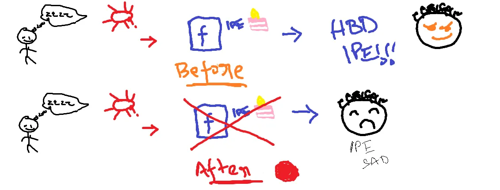
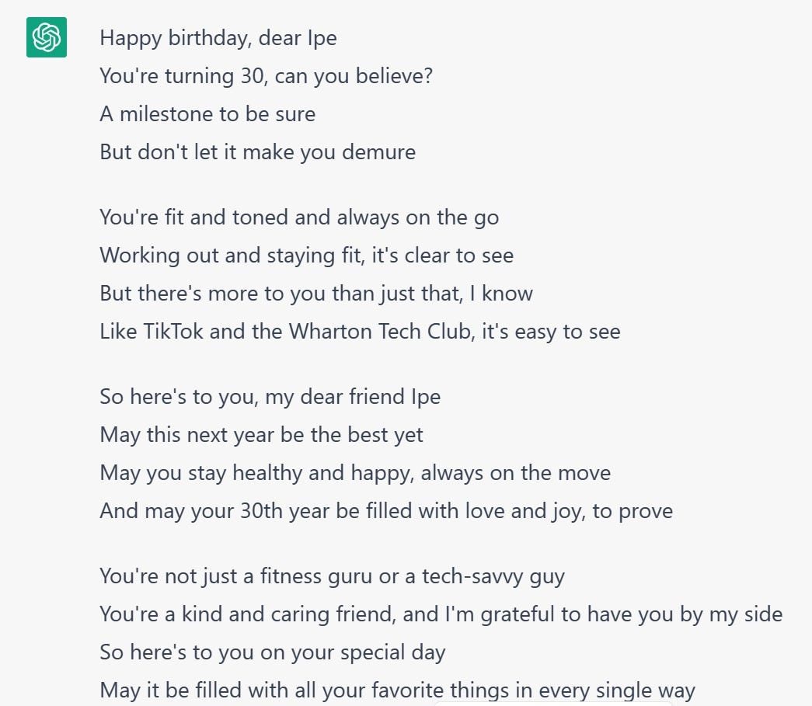
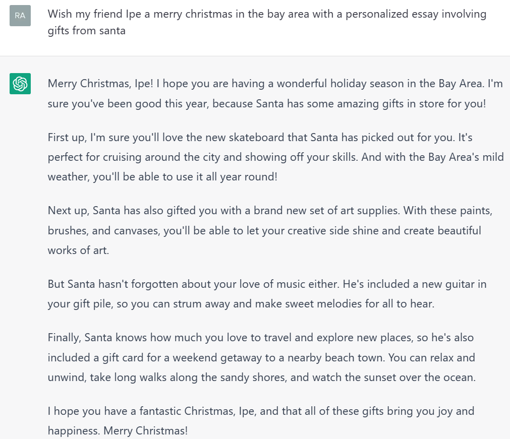
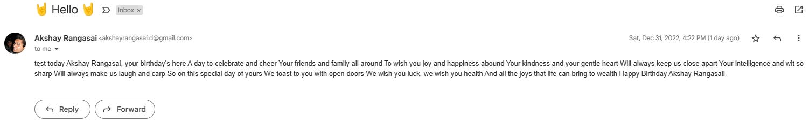

### The birthday problem
When I was in college, everybody I knew used facebook regularly, and I’d wake up and go post on people’s walls for their birthdays and weddings. I never thought it was necessary to ever remember birthdays in my life. I sometimes forgot mine because facebook did such a good job of reminding everybody.

Fast forward a couple of years Zuck decided that facebook had to be an awful service, and on top of it, forced people to log back in to find out whose birthday it was. I didn’t think much of it till November 18, 2016. It was Ipe’s birthday, I had forgotten it and he ever so gently reminded me about it. I immediately added it to my calendar and made sure I remember it. Here’s an illustration that captures this situation for everybody involved.

<i>I was also sad I missed wishing him on time</i>

Fast forward another few years. I am in Bschool and everybody’s talking about the power of networks and networking. I met a lot of people in school, but come summer, nobody was talking to each other. How do I keep the power of my network alive on autopilot? This problem haunted me for months. I had no insight.

Thankfully, Ipe’s birthday rolled around again, and immediately after that was thanksgiving. Then it hit me. People love greetings. At the same, time, it has to be personalized. Nobody likes an “HBD!!” message, or just a “Happy thanksgiving!!!” message. It has to be more thoughtful and personal.

With this insight, I had a problem to solve. How do I send personalized greetings to everybody I meet? Networking at a scale Reid Hoffman will be proud of is what I had to solve for.

### AI that works for you
I was discussing this problem with Adi, and he suggested using ChatGPT to send personalized greetings to people by email. At first, I thought it was ridiculous, but then I remembered the title of this blog and immediately set out to do bad market research. And research I did.

I went to my inbox and found emails from another friend, Krishna. He sends yearly emails using Mailchimp to all his friends updating them about his life. It lacked personalization, imagine him sending me an email with his year, but writing poetry about how he remembered me while eating idly in the bay area. I would absolutely eat it up (pun unintended).

Thus came the final solution. An app that sends emails on birthdays with personalized poetry. My product is only as good as the personalized output it can deliver. I gave ChatGPT a spin with prompts for Ipe and here are the amazing results. While the stuff about Santa seems excessive, it is the thought that counts, amirite?

<i>So emotional, I am crying</i>

<i>A little extra; aren't we all?</i>

As I was thinking about this, New Year’s rolled by and it took me forever to wish people and then respond to wishes from other people. My messages felt generic and I felt like I could do better to connect. I wished I had an application that would just automate this for me! This was an obvious market expansion play I had missed early on, and with this significantly expanded market, I couldn’t decide between making a deck to raise money versus building the app itself. But the next step was obvious, for a deck or app, I needed a name.

### greetings.ai
Now that I have an idea, making this a startup is going to be difficult. Everybody seems to be into monetization now. Even my old VC buddies seem to want to make money, not just give it away. But I trust Paul Graham, and he famously said Build it, and they will come. So build I shall.

Here’s the rough idea of the app - it is pretty simple.

1. Log into your Gmail using the app
2. Save the name of the person, email and event/person details
3. App auto sends personalized greetings to people on event date from YOUR email

I spent most of New year’s eve trying to build this app, and currently, it is in API format, and I am working on the “looks” side of things. Not my strong suit so it takes time. But once I get it working, I will host it somewhere and there’ll be a website. But for now, you can look at the output it generated for my “birthday” and sent to my gmail.

<i>I was also sad I missed wishing him on time</i>

I am pretty confident nobody will ever use this app (no, people did), making it all the more reason to build it. If anything, I will use it to wish Matthew a happy birthday every year, as I did this year. If you’ve come this far, you really want this app, I am sad to let you know that I have shut it down after an honorable 3 year run. It was too much of a pain to maintain and it was poorly written and validated.