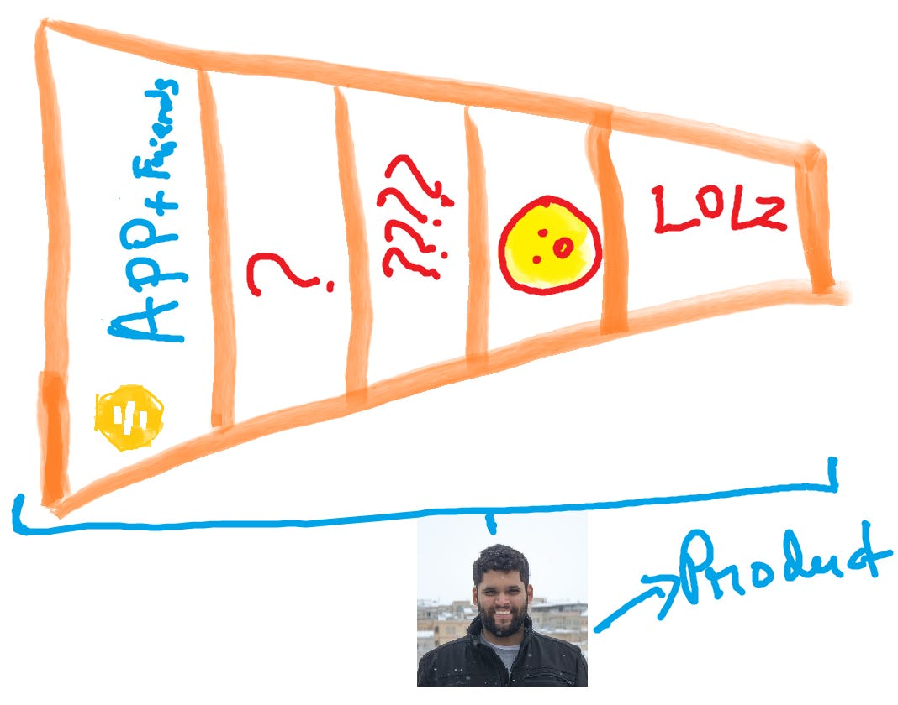
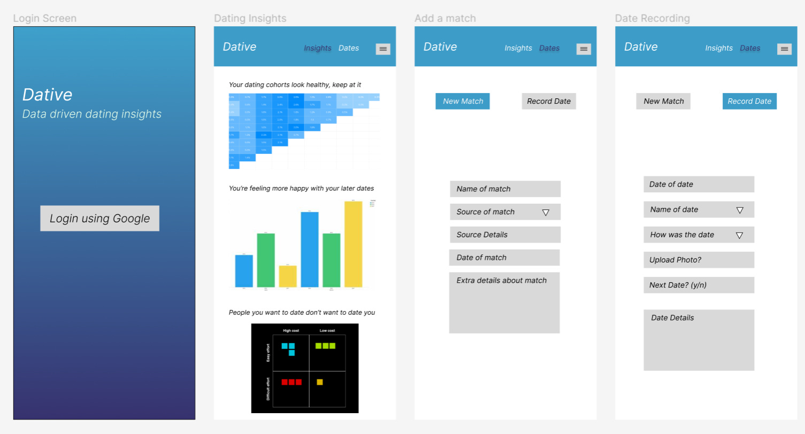

Dating in the modern world is hard, and even if you manage to find a partner, most people end up breaking up at least once. There is no personalized data-driven approach to dating, and the rate of breakups going up (No statistics because they are worse than lies).

Finding success in dating requires a continous process of discovery. Are you going on dates with the people you actually like versus who you think you like, and the next question is, are you going on dates with people who like you, versus people who will not like you. This is important, because if you go on dates with people who will never like you, well, good luck.

I propose a solution that mines your data for insights and optimizes dating to make it more successful in whatever dimension you choose. I do not hope to solve the problem of finding dates (Bumble, Hinge and good friends help here), but rather improve with whoever you manage to get dates with. If the Fed can ease quantitatively, we can date quantitatively.

## Inspiration for solutions
In the last couple of years (2021 and 2022) Product Led Growth has been all the rage. Everybody wants to go for a bottom-up growth, organic growth approach. Make the product do the work, they say. Get the “Aha” moment immediately, force retention and maybe share it with others within the organization. For those of you living under a rock, here is a blog summarizing the basics of PLG and another on pirate metrics.

To be really honest, this has existed forever, but for some reason, VCs think this is the new oil in software. But VCs also have nothing better to do with their time, so will give them a pass for this. As any deep thinker would, I believed this was my toolkit, and like any person with a hammer (tool), I tried to find nails to apply this hammer everywhere in my life. This sentence probably also tells you that I am doing/have done an MBA. Don’t judge.

Besides being a perfection-obsessed practitioner of growth (as a PM, none of that ninja shit), I am also a really single guy in Boston/SF. I found a problem worth solving, a really thorny problem. The problem of dating. I used my first principle problem-solving skills sharpened in consulting and VC, and hardened by growth. This was a problem my toolkit was well suited for. This is a traditional PLG problem. Here’s why:

1. I am the product (Is your mind blown?)

2. I reach my dates (customers) through dating apps (Google, Fb, LinkedIn, etc)
    1. If you’re not a CAC purist (SEO), you probably subscribe to premium (Ads)

3. My retention and conversion are pretty shit
    1. Oh man, I do not even know why

Wow, this is mindblowing, this is the exact same problem I have been solving for software companies. Time to deploy the toolkit and solve the problem.

<i>Toolkit Time</i>

I took a funnel approach to this problem. The Pirate funnel (Acquisition, Activation, Retention, Referral, Revenue), but to solution a problem, you need to diagnose the problem and then solution it. I went for the metrics, I wanted to look at all the data in terms of conversions, so I started drawing out my funnel, and this is what it looked like.

 

<i>Do I really know what I want?</i>

I had no data! I used multiple apps, my friends were a very weak channel for acquisition (pretty sure 0% but no data to back it up, thanks Camy). I just knew I used apps to get dates, but no insight into what worked and what didn’t. I had no idea how to improve anything! How do I decide between these options?

1. Product improvements - Do I need to lift more and get more jacked or do I need to learn to play the guitar better?

2. Acquisition improvements - Do I spend more time swiping/talking to women on Bumble or Hinge? Do I give up on apps and focus on making better friends than Camy?

3. Activation improvements - Do I swipe more and find new dates, or will I not need to? Will I get overwhelmed and spread myself too thin?

4. Retention improvements - What are the things I did /said to get a second date and/or the third date?

This seemed like a problem that needed a solution.

I googled a bit, found nothing in the first 3 results, and decided this is my first startup idea. Paul Graham famously said “Make something people want”, and make something I want, I will.

## Dative - The personalized dating insights platform
 Know who you want, and who wants you

Dative is a data and insights platform that improves your dating decision-making. The idea is quite simple. An easy-to-use app to track dates, and analyze dating history over time.

Dative will be the source where you can manage dates, think about people you like and do not, and answer all questions with data. But the product is only as good as the data - the user must input the right data for the best calculations and insights. Longer term, we will try to automate it. Dative will end the tyranny of choice and help you answer “What is my type?” with data and conviction.

Here’s a step-by-step view of what Dative will do

1. Enter date data into dative

2. Source your dates, we do the analysis

3. Answer complex questions through advanced analytics

    1. Does taking an awkward selfie after the date improve chances of getting another date?

    2. If you’re pretty post-modern about dating, you can even find out how your polyamory is working out

4. Done

Yep, that’s it. We might add fancier features but this is the beginning. Now you’ll finally know if the problem is Camy or your face.

<i>Best app you've ever seen</i>

I do not wish to receive feedback about my choices of colour
The design is focused on adding data as quickly as possible, and then getting insights about your dating life. There’s a ton of other information that could be helpful, but would I (or anybody) really fill it out?

## Launch
As I wrote this blog post and built this mock, I thought about what the app will actually feel like to use. Keeping in line with starting and ending projects on a whim, I decided this idea is worth launching, if not for anything but the sheer fun of it. Who knows if it’ll actually get launched? (Maybe need an app to keep track of un-launched projects). In true awful PM fashion, I spoke to exactly one friend who told me that he recorded his dates in a notebook, and black worked well for him. This data-driven insight from him motivated me to write a PRD here.

> Akshay, you are an MBA, how will you build this app and launch it?

I am sure this is what you’re thinking. Luckily, my housemate is an engineer who for some strange reason decided to do an MBA to become a PM (somebody please tell him he doesn’t need it) and he’s really bought into it; He also has nothing to do in December.

We will launch the app by Mid-Jan (hopefully, but time will tell). We all know the problems with engineers are with their infinite delays for launch.

Watch this space. This post will be updated frequently over the next few days as we get to launch!

### Spoiler alert

I did not end up launching this application. 
